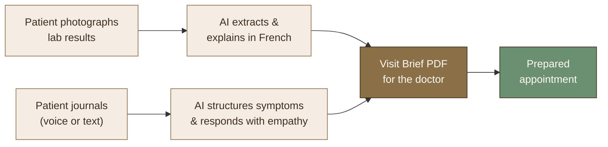
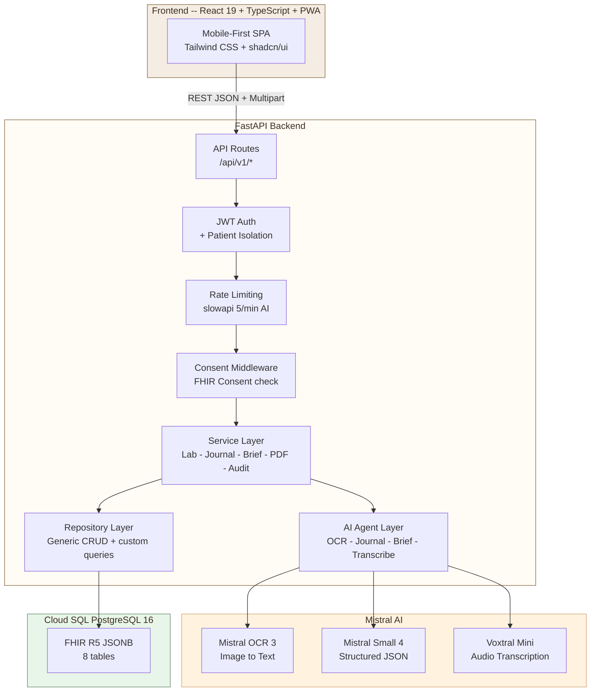
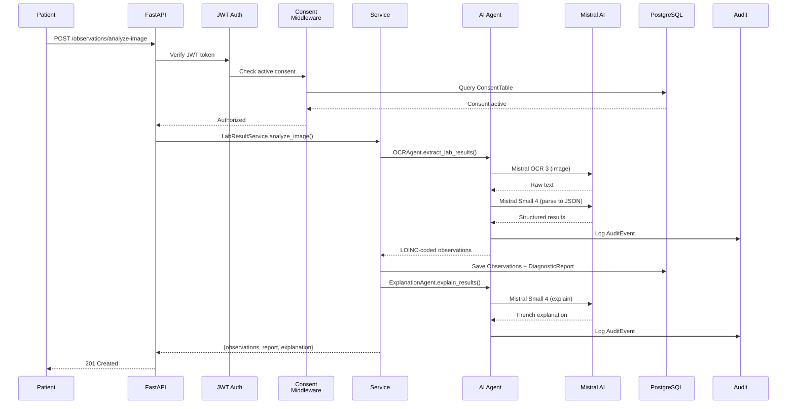
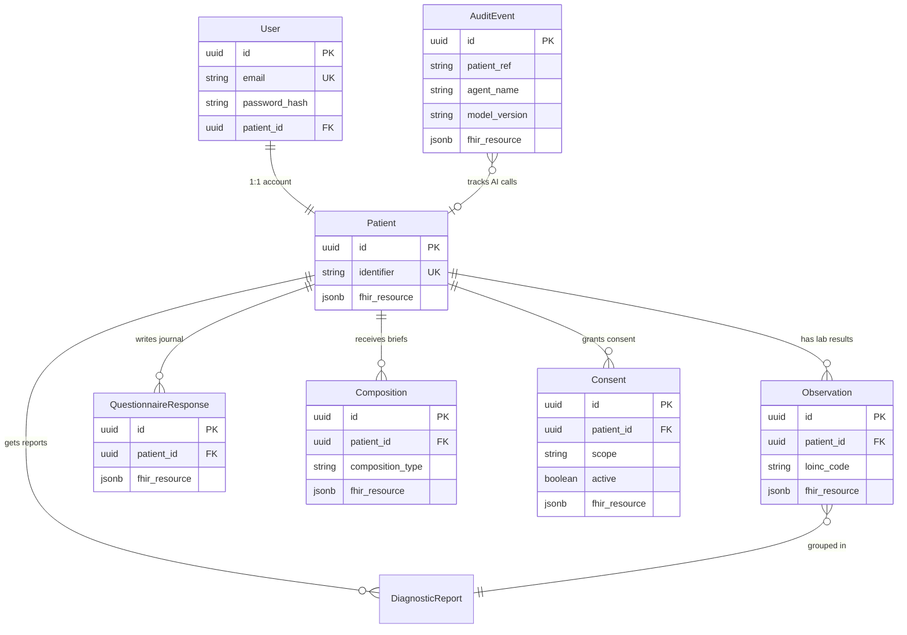
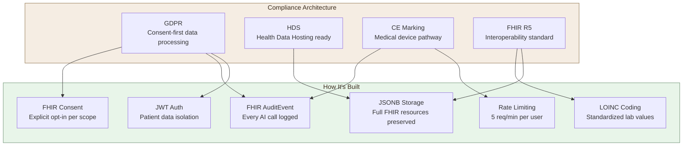

<div align="center">

# Entre Deux

**FHIR-native AI companion for chronic condition patients**

_Filling the gap between doctor appointments with consent-first, audit-logged intelligence_

[](https://github.com/soneeee22000/entre-deux/actions/workflows/ci.yml)
[](https://python.org)
[](https://typescriptlang.org)
[](https://react.dev)
[](https://fastapi.tiangolo.com)
[](https://hl7.org/fhir/R5/)
[](https://mistral.ai)
[](LICENSE)

**[Live Demo](https://entre-deux-web-102991984200.europe-west1.run.app)** | Login: `sophie@entredeux.demo` / `sophie2024!`

</div>

---

## The Problem

Patients with chronic conditions see their specialist every **3-6 months**. Between visits, they're alone:

- They can't interpret their lab results
- They forget symptoms to report
- They carry the emotional weight of managing their condition in silence
- When they finally see their doctor, **60% blank out**

**11 million** informal caregivers in France manage someone else's health with no tools to help.

## The Solution

**Entre Deux** is an AI-powered health companion that helps patients **understand**, **remember**, and **prepare** between doctor appointments. Built consent-first on FHIR R5, powered by Mistral AI, designed for the French B2B2C healthcare market.



## Features

### Lab Result Translator

Patient photographs their blood work. **Mistral OCR** extracts LOINC-coded observations, creates a FHIR DiagnosticReport, and **Mistral Small** explains in plain French. Results are grouped by test type with trend arrows, color-coded severity, and visual range bars.

### Voice & Text Journal

Between appointments, patients describe how they feel -- by voice (**Voxtral** transcription) or text. AI structures it into a FHIR QuestionnaireResponse with symptoms, emotional state, severity, and an empathetic response in French.

### Visit Brief with PDF Export

Before the next appointment, AI generates a FHIR Composition with 4 sections: key changes, symptom evolution, lab trends, and suggested questions for the doctor. Downloadable as a formatted PDF.

### Patient-Friendly Analytics

Lab results are presented with traffic-light color coding (green/amber/red), trend arrows showing improvement, horizontal range bars, and plain-language French explanations -- designed for patients with low health literacy.

### JWT Auth + Patient Isolation

Per-user accounts with JWT access/refresh tokens. Patient data is fully isolated -- one patient cannot access another's records.

### Consent + Audit Trail

Every AI interaction requires explicit patient consent (FHIR Consent). Every AI call is audit-logged (FHIR AuditEvent). Designed for **GDPR**, **HDS**, and **CE marking** compliance.

### PWA with Offline Support

Installable as a Progressive Web App on mobile devices. Service worker caches the app shell for offline access. Standalone display mode.

---

## Architecture



### AI Agent Pipeline



### FHIR Data Model



---

## Tech Stack

| Layer        | Technology                                                  | Purpose                                                          |
| ------------ | ----------------------------------------------------------- | ---------------------------------------------------------------- |
| **AI**       | Mistral Small 4, Mistral OCR 3, Voxtral Mini                | Structured extraction, empathetic responses, voice transcription |
| **Backend**  | Python 3.12, FastAPI, SQLAlchemy async, Alembic             | FHIR-native REST API with dependency injection                   |
| **Auth**     | JWT (python-jose) + bcrypt (passlib), slowapi rate limiting | Per-user auth with patient data isolation                        |
| **FHIR**     | fhir.resources 8.x (R5), LOINC                              | Clinical data interoperability standard                          |
| **Frontend** | React 19, TypeScript (strict), Tailwind CSS 4, shadcn/ui    | Mobile-first patient PWA interface                               |
| **Database** | PostgreSQL 16, JSONB, asyncpg                               | FHIR resources stored as validated JSONB                         |
| **PDF**      | reportlab                                                   | Visit brief PDF generation                                       |
| **Deploy**   | Docker, Google Cloud Run (europe-west1), Cloud SQL          | Production deployment in Paris region                            |
| **Testing**  | pytest (105), vitest (83), Playwright (19)                  | 207 total tests across unit, integration, and E2E                |
| **CI/CD**    | GitHub Actions (4 jobs), Docker Compose                     | Automated lint, mypy strict, test, build, E2E                    |

---

## API Endpoints

### Public (no auth)

| Method | Endpoint                | Description            |
| ------ | ----------------------- | ---------------------- |
| `GET`  | `/api/v1/health`        | Health check (DB + AI) |
| `POST` | `/api/v1/auth/register` | Create account         |
| `POST` | `/api/v1/auth/login`    | Authenticate           |
| `POST` | `/api/v1/auth/refresh`  | Refresh token pair     |

### Protected (JWT required, patient-isolated)

| Method | Endpoint                                        | Description                               | Rate Limit |
| ------ | ----------------------------------------------- | ----------------------------------------- | ---------- |
| `POST` | `/api/v1/patients`                              | Register a new patient                    |            |
| `GET`  | `/api/v1/patients/{id}`                         | Get patient by ID                         |            |
| `GET`  | `/api/v1/patients/{id}/timeline`                | Full patient timeline                     |            |
| `POST` | `/api/v1/observations/analyze-image`            | OCR lab photo into Observations           | 5/min      |
| `POST` | `/api/v1/observations`                          | Create manual observation                 |            |
| `GET`  | `/api/v1/observations/patients/{id}`            | List patient observations                 |            |
| `POST` | `/api/v1/questionnaire-responses`               | Create text journal entry                 | 5/min      |
| `POST` | `/api/v1/questionnaire-responses/audio`         | Voice journal (transcribe + create entry) | 5/min      |
| `GET`  | `/api/v1/questionnaire-responses/patients/{id}` | List journal entries                      |            |
| `POST` | `/api/v1/compositions/visit-brief`              | Generate visit brief                      | 5/min      |
| `GET`  | `/api/v1/compositions/{id}/pdf`                 | Download visit brief as PDF               |            |
| `GET`  | `/api/v1/compositions/patients/{id}`            | List compositions                         |            |
| `POST` | `/api/v1/consents`                              | Record patient consent                    |            |
| `PUT`  | `/api/v1/consents/{id}/revoke`                  | Revoke consent                            |            |
| `GET`  | `/api/v1/consents/patients/{id}`                | List patient consents                     |            |
| `GET`  | `/api/v1/audit-events`                          | List audit trail                          |            |

---

## Getting Started

### Prerequisites

- Python 3.12+
- Node.js 22+
- PostgreSQL 16+ (or Docker)
- [Mistral AI API key](https://console.mistral.ai/)

### Quick Start (Docker)

```bash
git clone https://github.com/soneeee22000/entre-deux.git
cd entre-deux
cp backend/.env.example backend/.env   # add your MISTRAL_API_KEY
docker compose up --build               # backend :8000 | frontend :5173 | postgres :5433
```

### Demo Data

```bash
cd backend && python -m scripts.seed_demo
# Creates Sophie Martin with 3-month diabetes journey:
#   10 lab results, 6 journal entries, 2 visit briefs
#   Login: sophie@entredeux.demo / sophie2024!
```

### Manual Setup

**Backend:**

```bash
cd backend
cp .env.example .env                    # add your MISTRAL_API_KEY + JWT_SECRET_KEY
pip install -r requirements.txt
alembic upgrade head                    # run database migrations
uvicorn src.main:app --reload --port 8000
```

**Frontend:**

```bash
cd frontend
npm install
npm run dev                             # starts at http://localhost:5173
```

### Testing

```bash
# Backend -- 105 tests (ruff + mypy strict + pytest + coverage)
cd backend
ruff check src/ tests/
mypy src/ --ignore-missing-imports --strict
pytest -v --cov=src --cov-fail-under=80

# Frontend -- 83 unit tests
cd frontend && npm test

# E2E -- 19 Playwright tests
cd frontend && npm run test:e2e

# Docker build
docker compose build
```

---

## Project Structure

```
entre-deux/
├── docker-compose.yml
├── .github/workflows/
│   ├── ci.yml                     # CI: lint + mypy strict + test + build + E2E
│   └── deploy.yml                 # Cloud Run deploy (manual dispatch)
│
├── backend/
│   ├── Dockerfile                 # Python 3.12, non-root, healthcheck
│   ├── requirements.txt
│   ├── alembic/                   # Database migrations
│   ├── scripts/seed_demo.py       # Sophie Martin demo data seeder
│   └── src/
│       ├── main.py                # FastAPI app + exception handlers
│       ├── config/settings.py     # Pydantic settings from .env
│       ├── agents/                # 5 Mistral AI agents
│       │   ├── ocr_agent.py       #   Image -> LOINC-coded observations
│       │   ├── explanation_agent.py #  Lab values -> French explanation
│       │   ├── journal_agent.py   #   Transcript -> structured + empathy
│       │   ├── brief_agent.py     #   Data -> visit brief sections
│       │   └── transcribe_agent.py #  Audio -> text (Voxtral REST)
│       ├── services/              # 6 business logic orchestrators
│       │   ├── lab_result_service.py
│       │   ├── journal_service.py
│       │   ├── visit_brief_service.py
│       │   ├── pdf_service.py     #   reportlab PDF generation
│       │   ├── consent_service.py
│       │   └── audit_service.py
│       ├── middleware/
│       │   ├── auth.py            # JWT verification + patient isolation
│       │   ├── consent.py         # Consent enforcement (JSON + multipart)
│       │   └── rate_limit.py      # slowapi 5/min AI, 10/min auth
│       ├── models/                # FHIR helpers, constants, Pydantic schemas
│       ├── db/                    # Engine, base, 8 tables, 8 repositories
│       └── api/v1/               # 8 versioned route modules
│
├── frontend/
│   ├── Dockerfile                 # Node 22 build + nginx + envsubst proxy
│   ├── nginx.conf                 # Security headers + gzip + API proxy
│   ├── e2e/                       # 5 Playwright E2E test suites
│   └── src/
│       ├── App.tsx                # Router: 7 pages
│       ├── components/ui/         # 11 reusable UI components
│       │   ├── Button, Card, Badge, Input, Textarea
│       │   ├── PageHeader, LoadingSpinner, EmptyState
│       │   ├── ErrorBanner, ErrorBoundary
│       │   └── MicrophoneButton   # Voice recording UI
│       ├── pages/                 # 7 pages
│       │   ├── LoginPage          # Email/password auth
│       │   ├── OnboardingPage     # Registration + consent
│       │   ├── DashboardPage      # Activity timeline + quick actions
│       │   ├── LabResultsPage     # Grouped trends + range bars
│       │   ├── JournalPage        # Voice/text + AI response
│       │   ├── VisitBriefPage     # Generate + PDF download
│       │   └── SettingsPage       # Consent management + logout
│       └── lib/
│           ├── api.ts             # API client with token refresh
│           ├── fhir.ts            # FHIR type definitions + helpers
│           ├── use-audio-recorder.ts  # MediaRecorder hook
│           ├── use-async-data.ts  # Data fetching hook
│           └── use-patient.ts     # Patient context
│
└── docs/
    ├── PRD.md                     # Product Requirements Document
    ├── ARCHITECTURE.md            # Architecture Decision Records
    └── STRATEGY.md                # Market strategy & positioning
```

---

## Deployment

Deployed on **Google Cloud Run** in `europe-west1` (Paris).

| Service     | URL                                                        |
| ----------- | ---------------------------------------------------------- |
| Frontend    | `https://entre-deux-web-102991984200.europe-west1.run.app` |
| Backend API | `https://entre-deux-api-102991984200.europe-west1.run.app` |

```bash
# Deploy manually
gcloud run deploy entre-deux-api --source=./backend --region=europe-west1
gcloud run deploy entre-deux-web --source=./frontend --region=europe-west1

# Or use GitHub Actions workflow
gh workflow run deploy.yml
```

---

## Regulatory Design



---

## Business Model

| Dimension   | Detail                                                                     |
| ----------- | -------------------------------------------------------------------------- |
| **Market**  | French B2B2C healthcare (diabetes-first)                                   |
| **Buyers**  | Healthcare insurers (mutuelles), hospital groups, diabetes care networks   |
| **Revenue** | Per-patient SaaS licensing to enterprise buyers                            |
| **TAM**     | 4M+ diabetic patients in France, 11M informal caregivers                   |
| **Moat**    | FHIR-native data model + regulatory compliance + Mistral AI (sovereign AI) |

---

## License

This project is licensed under the MIT License. See [LICENSE](LICENSE) for details.

---

<div align="center">

Built with [Mistral AI](https://mistral.ai) | [FHIR R5](https://hl7.org/fhir/R5/) | [FastAPI](https://fastapi.tiangolo.com) | [React](https://react.dev)

Deployed on [Google Cloud Run](https://cloud.google.com/run) (europe-west1, Paris)

</div>
