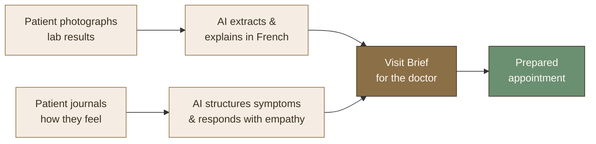
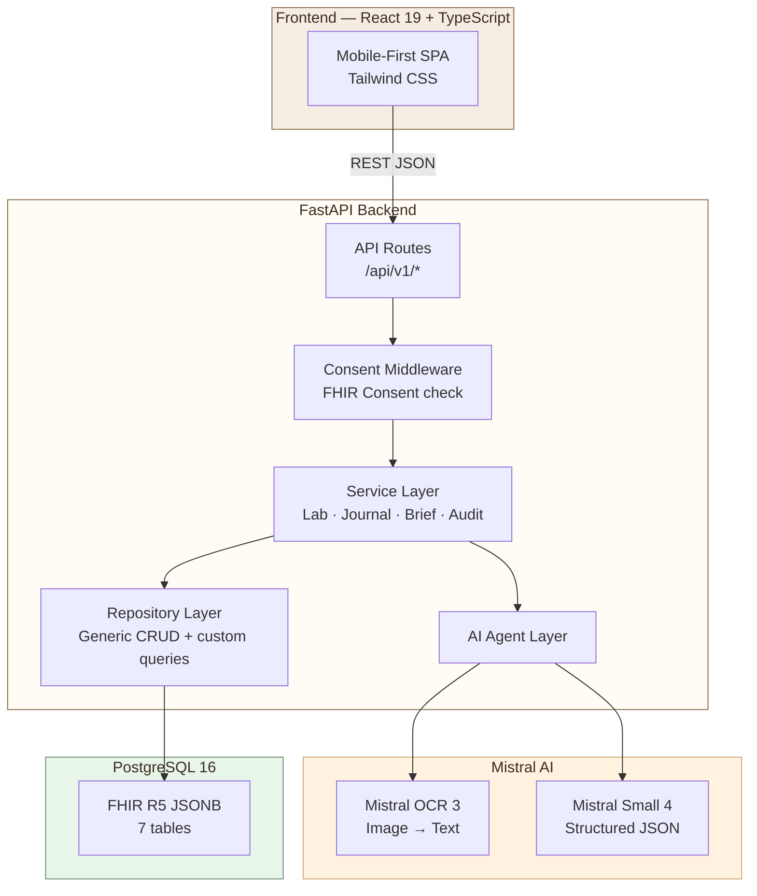
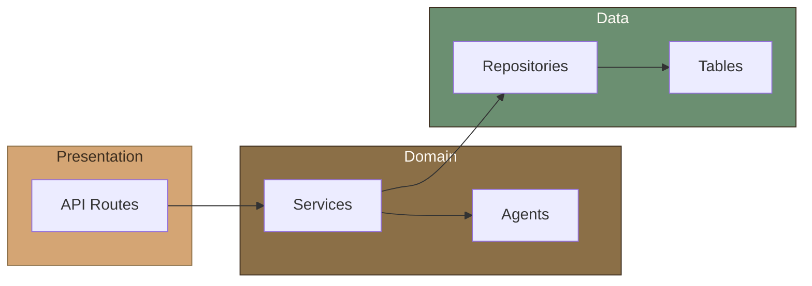
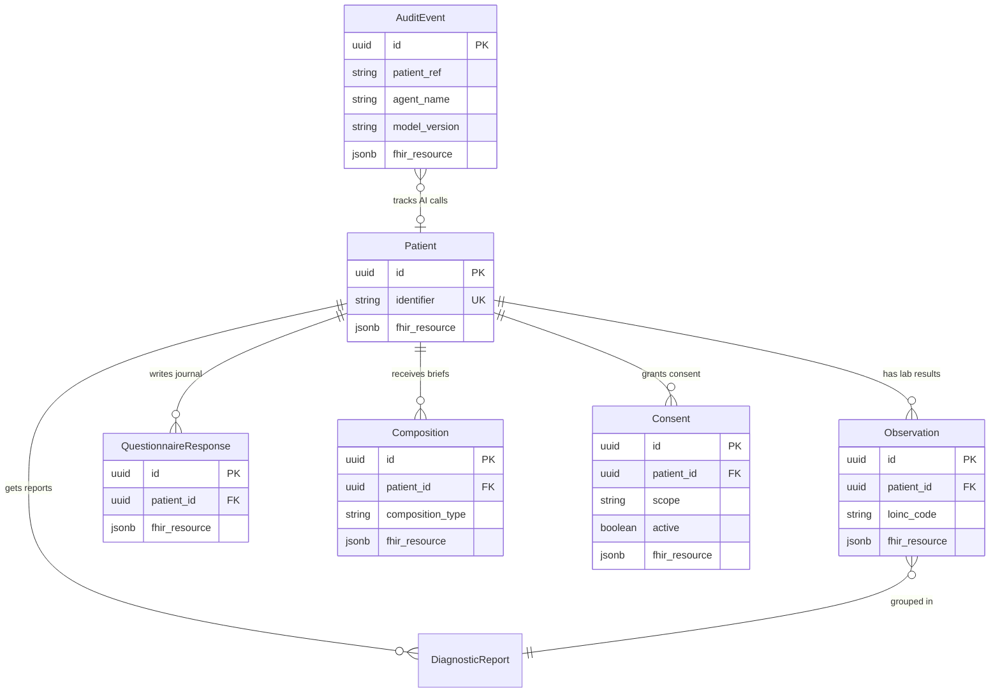
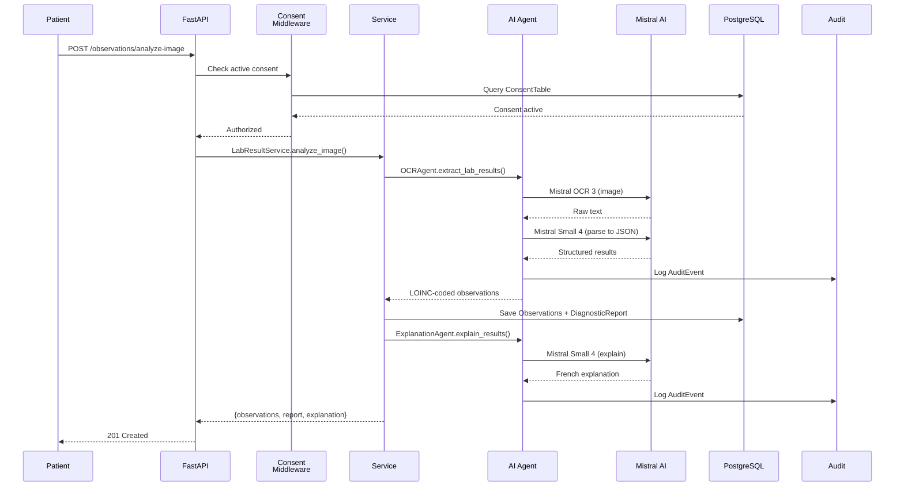
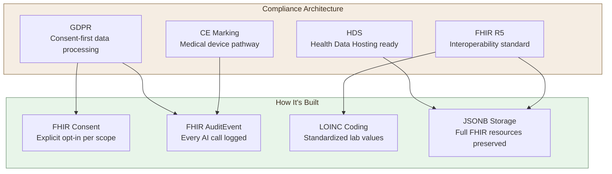

<div align="center">

# Entre Deux

**FHIR-native AI companion for chronic condition patients**

_Filling the gap between doctor appointments with consent-first, audit-logged intelligence_

[](https://github.com/soneeee22000/entre-deux/actions/workflows/ci.yml)
[](https://python.org)
[](https://typescriptlang.org)
[](https://react.dev)
[](https://fastapi.tiangolo.com)
[](https://hl7.org/fhir/R5/)
[](https://mistral.ai)
[](LICENSE)

</div>

---

## The Problem

Patients with chronic conditions see their specialist every **3-6 months**. Between visits, they're alone:

- They can't interpret their lab results
- They forget symptoms to report
- They carry the emotional weight of managing their condition in silence
- When they finally see their doctor, **60% blank out**

**11 million** informal caregivers in France manage someone else's health with no tools to help.

## The Solution

**Entre Deux** is an AI-powered health companion that helps patients **understand**, **remember**, and **prepare** between doctor appointments. Built consent-first on FHIR R5, designed for the French B2B2C healthcare market.



## Features

### Lab Result Translator

Patient photographs their blood work. **Mistral OCR** extracts LOINC-coded observations, creates a FHIR DiagnosticReport, and **Mistral Small** explains in plain French:

> _"Votre HbA1c est passee de 7.2 a 6.8 -- c'est bien, votre glycemie moyenne sur 3 mois s'est amelioree."_

### Health Journal

Between appointments, patients describe how they feel. AI structures it into a FHIR QuestionnaireResponse with symptoms, emotional state, severity, and an empathetic response.

### Visit Brief Generator

Before the next appointment, AI generates a FHIR Composition with 4 sections: key changes, symptom evolution, lab trends, and suggested questions for the doctor.

### Consent + Audit Trail

Every AI interaction requires explicit patient consent (FHIR Consent). Every AI call is audit-logged (FHIR AuditEvent). Designed for **GDPR**, **HDS**, and **CE marking** compliance.

---

## Architecture



### Clean Architecture Layers



### FHIR Data Model



### AI Agent Pipeline



---

## Tech Stack

| Layer          | Technology                                    | Purpose                                                       |
| -------------- | --------------------------------------------- | ------------------------------------------------------------- |
| **AI**         | Mistral Small 4, Mistral OCR 3                | Structured extraction, empathetic responses, brief generation |
| **Backend**    | Python 3.10+, FastAPI, SQLAlchemy async       | FHIR-native REST API with dependency injection                |
| **FHIR**       | fhir.resources 8.x (R5), LOINC                | Clinical data interoperability standard                       |
| **Frontend**   | React 19, TypeScript (strict), Tailwind CSS 4 | Mobile-first patient interface                                |
| **Database**   | PostgreSQL 16, JSONB, asyncpg                 | FHIR resources stored as validated JSONB                      |
| **Migrations** | Alembic                                       | Schema versioning with auto-run on deploy                     |
| **Testing**    | pytest (61 tests), vitest (56 tests)          | Unit + integration coverage                                   |
| **CI/CD**      | GitHub Actions, Docker, Google Cloud Run      | Automated lint, type-check, test, build                       |

---

## API Endpoints

| Method | Endpoint                                        | Description                     | Auth    |
| ------ | ----------------------------------------------- | ------------------------------- | ------- |
| `POST` | `/api/v1/patients`                              | Register a new patient          | --      |
| `GET`  | `/api/v1/patients/{id}`                         | Get patient by ID               | --      |
| `GET`  | `/api/v1/patients/{id}/timeline`                | Full patient timeline           | --      |
| `POST` | `/api/v1/observations/analyze-image`            | OCR lab photo into Observations | Consent |
| `POST` | `/api/v1/observations`                          | Create manual observation       | --      |
| `GET`  | `/api/v1/observations/patients/{id}`            | List patient observations       | --      |
| `POST` | `/api/v1/questionnaire-responses`               | Create journal entry            | Consent |
| `GET`  | `/api/v1/questionnaire-responses/patients/{id}` | List journal entries            | --      |
| `POST` | `/api/v1/compositions/visit-brief`              | Generate visit brief            | Consent |
| `GET`  | `/api/v1/compositions/patients/{id}`            | List compositions               | --      |
| `POST` | `/api/v1/consents`                              | Record patient consent          | --      |
| `PUT`  | `/api/v1/consents/{id}/revoke`                  | Revoke consent                  | --      |
| `GET`  | `/api/v1/audit-events`                          | List audit trail                | --      |

---

## Getting Started

### Prerequisites

- Python 3.10+
- Node.js 24+
- PostgreSQL 16+ (or Docker)
- [Mistral AI API key](https://console.mistral.ai/)

### Quick Start (Docker)

```bash
git clone https://github.com/soneeee22000/entre-deux.git
cd entre-deux
cp backend/.env.example backend/.env   # add your MISTRAL_API_KEY
docker compose up --build               # backend :8000 | frontend :5173 | postgres :5433
```

Open [http://localhost:5173](http://localhost:5173) in your browser.

### Manual Setup

**Backend:**

```bash
cd backend
cp .env.example .env                    # add your MISTRAL_API_KEY
pip install -r requirements.txt
alembic upgrade head                    # run database migrations
uvicorn src.main:app --reload --port 8000
```

**Frontend:**

```bash
cd frontend
npm install
npm run dev                             # starts at http://localhost:5173
```

### Testing

```bash
# Backend — 61 tests
cd backend && pytest -v

# Frontend — 56 tests
cd frontend && npm test

# Linting
cd backend && ruff check src/ tests/
cd frontend && npm run lint
```

---

## Project Structure

```
entre-deux/
├── docker-compose.yml
├── .github/workflows/ci.yml       # CI: lint + type-check + test + build
│
├── backend/
│   ├── Dockerfile
│   ├── requirements.txt
│   ├── alembic/                    # Database migrations
│   └── src/
│       ├── main.py                 # FastAPI app + router wiring
│       ├── config/settings.py      # Pydantic settings from .env
│       ├── agents/                 # 4 Mistral AI agents
│       │   ├── ocr_agent.py        #   Image → LOINC-coded observations
│       │   ├── explanation_agent.py #   Lab values → French explanation
│       │   ├── journal_agent.py    #   Transcript → structured + empathy
│       │   └── brief_agent.py      #   Data → visit brief sections
│       ├── services/               # 5 business logic orchestrators
│       ├── middleware/consent.py    # Consent enforcement dependency
│       ├── models/                 # FHIR helpers, constants, Pydantic schemas
│       ├── db/                     # Engine, base, 7 tables, 8 repositories
│       └── api/v1/                 # 7 versioned route modules
│
├── frontend/
│   ├── Dockerfile + nginx.conf     # Multi-stage build → nginx
│   └── src/
│       ├── App.tsx                 # Router: 6 pages
│       ├── components/             # 9 reusable UI components
│       ├── pages/                  # Onboarding, Dashboard, Journal,
│       │                           #   LabResults, VisitBrief, Settings
│       └── lib/                    # API client, FHIR types, patient context
│
└── docs/
    ├── PRD.md                      # Product Requirements Document
    ├── ARCHITECTURE.md             # Architecture Decision Records
    └── STRATEGY.md                 # Market strategy & positioning
```

---

## Regulatory Design



---

## Business Model

| Dimension   | Detail                                                                     |
| ----------- | -------------------------------------------------------------------------- |
| **Market**  | French B2B2C healthcare (diabetes-first)                                   |
| **Buyers**  | Healthcare insurers (mutuelles), hospital groups, diabetes care networks   |
| **Revenue** | Per-patient SaaS licensing to enterprise buyers                            |
| **TAM**     | 4M+ diabetic patients in France, 11M informal caregivers                   |
| **Moat**    | FHIR-native data model + regulatory compliance + Mistral AI (sovereign AI) |

---

## License

This project is licensed under the MIT License. See [LICENSE](LICENSE) for details.

---

<div align="center">

Built with [Mistral AI](https://mistral.ai) | [FHIR R5](https://hl7.org/fhir/R5/) | [FastAPI](https://fastapi.tiangolo.com) | [React](https://react.dev)

</div>
